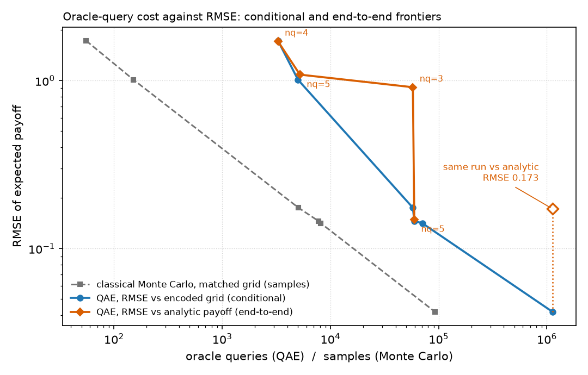

# Quantum amplitude estimation for European option pricing: a reproduction and error budget

[](https://github.com/SundusA0/qae-option-pricing/actions/workflows/tests.yml)

Quantum amplitude estimation (QAE) is a standard proposal for accelerating
derivative pricing, on the strength of a quadratic speedup over classical Monte
Carlo. This repository reproduces its known behaviour on a vanilla European call,
measures the main error sources, and follows the consequences through to compiled
circuits and hardware-oriented resource and noise proxies.

## Summary

**Question.** What remains of amplitude estimation's query advantage on a vanilla
European call after payoff encoding and finite sampling, and what circuit-depth
and noise constraints accompany those workloads?

**Result.** Three separate experiments. In the simulated estimator sweep, QAE
needs 8–60× more Grover-operator queries than classical Monte Carlo needs samples
on the same encoded grid across the tested budgets, and at a fixed grid
(`nq = 4`) the RMSE falls as `N^−0.65` (seed-bootstrap 95% interval
[−0.70, −0.60]), consistent with the `M^−2/3` rate of the lowest-depth payoff
encoding rather than the ideal `N^−1`. In the resource analysis, one application
of the Grover operator compiles to 515–1,804 routed two-qubit gates on a
heavy-hex-like topology (one transpiler seed; twenty seeds spread within about
±5% of their median), and the deepest circuit at ε = 10⁻⁴ is an estimated
2.2 × 10⁶ two-qubit gates. In the noise study, a two-qubit depolarising parameter
`p = 2 × 10⁻³` leads the useful-amplification heuristic to select
`k = 0`: no coherent amplification helps.

**Why.** The practical comparison is set by the payoff-linearisation trade-off,
the encoding error of the truncated and discretised distribution, and coherent
depth, not by the estimator's asymptotic query complexity. The end-to-end error
floor is not reached within this sweep.

**What is here.** Iterative amplitude estimation on a Qiskit Finance European
call; sweeps over qubit count, rescaling factor and target precision at 20 seeds
per configuration; an error budget that isolates encoding error and
characterises the linearisation and sampling contributions as systematic
offset and spread; a classical Monte Carlo comparison on the same encoded grid;
transpiled resource counts and the IQAE depth schedule; a depolarising-noise
simulation; a seed bootstrap over the frontier fits; tests and CI. This is a
reproduction and benchmarking study, not a new algorithm.



*Oracle queries against RMSE for one option. The conditional frontier (RMSE
against the encoded grid) keeps falling with more queries. The end-to-end
frontier (RMSE against the analytic payoff) stops improving within the tested
sweep: the most expensive run sits on the first curve and above the second,
because it was run at 4 uncertainty qubits, whose grid is already 0.132 from the
true value. The sweep does not establish where the end-to-end frontier would
eventually floor. Classical Monte Carlo on the same encoded grid needs 8–60×
fewer samples across the tested range.*

## What this is

This is a reproduction and benchmarking study rather than a new option-pricing
algorithm or asymptotic result. The underlying methods and trade-offs are
established in prior work:

| Component | Prior work |
|---|---|
| QAE for option pricing | Stamatopoulos et al. (2020); Qiskit Finance `EuropeanCallPricing` |
| The rescaling-factor trade-off and its `O(M^−2/3)` convergence rate | Woerner & Egger (2019), derived analytically |
| Fault-tolerant resource requirements for derivative pricing | Chakrabarti et al. (2021): 8k logical qubits, T-depth 5.4 × 10⁷ |
| Noise limiting useful amplification depth | Tanaka et al. (2021); Herbert et al. (2021) |
| Truncation and discretisation of a continuous distribution | Standard numerical analysis |

The [Qiskit Finance tutorial](https://qiskit-community.github.io/qiskit-finance/tutorials/03_european_call_option_pricing.html)
provides the lognormal loading, the truncation, the discretisation, the linearised
payoff with its rescaling factor, and iterative amplitude estimation. That is the
starting point, not a contribution.

This repository adds the experimental workflow: the parameter sweeps, separation
of encoding error from estimation error with bias distinguished from variance
across twenty seeds per configuration, instrumentation of the IQAE schedule, transpiled resource
counts, a depolarising-noise simulation, and the end-to-end frontier reported
below.

The goal is to measure these error sources together in one implementation and
identify which constraint dominates in practice. The European call has a
closed-form Black–Scholes reference, which is used as the analytic baseline.

---

## The error sources

| # | Source | Controlled by | Shrinks with more queries? |
|---|---|---|---|
| 1 | Truncation of the lognormal | window width `n_std` | no |
| 2 | Discretisation onto `2^nq` grid points | qubit count `nq` | no |
| 3 | Small-angle linearisation of the payoff | rescaling factor `c` | no |
| 4 | Finite sampling in amplitude estimation | target precision `ε` | yes |

Sources 1–3 are encoding and modelling errors rather than amplitude-estimation
sampling errors. Increasing the number of AE queries does not reduce them;
reducing them requires changing the encoded model — increasing grid resolution,
widening the truncation window, or using a more accurate payoff representation.

Sources 1 and 2 are measured together here, as the gap between the exact
expectation on the encoded grid and the analytic value. That gap includes
truncation, renormalisation of the truncated distribution, and discretisation;
this repository does not separate them with a continuous truncated reference.
`n_std` is measured in standard deviations of `S_T` in price space, following the
Qiskit tutorial, not in log-price space; the lognormal is asymmetric, so the two
tails are not cut at equal probability.

### Truncation and discretisation are coupled

Encoding error `|grid exact − analytic|`, before any estimation:

| `n_std` \ `nq` | 3 | 4 | 5 | 6 | 7 |
|---|---|---|---|---|---|
| **3** | 0.0257 | 0.3020 | 0.4044 | 0.4078 | 0.4251 |
| **4** | 0.4548 | 0.0091 | 0.0878 | 0.0834 | 0.0915 |
| **5** | 0.7651 | 0.1317 | 0.0041 | 0.0258 | 0.0145 |
| **6** | 0.2057 | 0.1736 | 0.0134 | 0.0206 | 0.0002 |
| **7** | 1.2994 | 0.1223 | 0.0563 | 0.0107 | 0.0022 |

The minimum along each row moves right as the window widens: the two parameters
have to be chosen together. Widening the window at fixed qubit count spreads the
same grid points over a larger interval; adding qubits inside a narrow window
resolves a distribution that has already been clipped. At `n_std = 3`,
increasing resolution ultimately exposes an error floor near 0.42 (5.7% of the
payoff), because the call payoff grows linearly in the upper tail and truncated
tail mass carries value.

The anomalously small 0.0257 at `n_std = 3, nq = 3` is cancellation between a
coarse grid overshooting and a truncation deficit, not accuracy. Reading that row
alone would suggest three qubits suffice.

### Systematic offset and spread respond oppositely to `c`

Twenty seeds per configuration, so a systematic offset can be distinguished from
sampling noise. At `ε = 10⁻³`, signed offset (`mean − grid`) with the standard
error of the mean, per qubit count. This is the offset of the whole IQAE
estimator relative to the grid expectation: it is consistent with the expected
payoff-linearisation bias, and may also contain finite-sampling estimator bias,
which this experiment does not separate.

| `c` | `nq` | signed offset | SE of mean | spread (sd) |
|---|---|---|---|---|
| 0.25 | 3 | +0.925 | 0.004 | 0.019 |
| 0.25 | 4 | +0.976 | 0.004 | 0.018 |
| 0.25 | 5 | +0.982 | 0.004 | 0.019 |
| 0.10 | 3 | +0.143 | 0.023 | 0.102 |
| 0.10 | 4 | +0.114 | 0.022 | 0.099 |
| 0.10 | 5 | +0.112 | 0.021 | 0.093 |
| 0.05 | 3 | +0.061 | 0.029 | 0.129 |
| 0.05 | 4 | +0.048 | 0.030 | 0.133 |
| 0.05 | 5 | +0.026 | 0.037 | 0.164 |

All observed mean offsets are positive. At `c = 0.25` and `c = 0.10` the positive
offset is clearly resolved, exceeding its standard error many times over at every
`nq`. At `c = 0.05` its magnitude and sign are not resolved at the present seed
count — each of the three is within about two standard errors of zero. A power-law fit over
the `nq`-averaged values (0.961, 0.123, 0.045) gives `c^1.92`, consistent with the
quadratic bias expected from a second-order linearisation error; the fit is
anchored by the two well-determined levels.

The spread increases as `c` decreases, as expected when the amplitude signal is
proportional to `c`. It does not follow a clean `1/c` law over these three points
(`sd × c` ranges from 0.0046 to 0.0098), partly because IQAE adapts its query
count to each configuration. Reducing `c` lowers the bias and raises the sampling
error; this is the trade-off Woerner & Egger analyse.

A single seed is insufficient at these parameter values because the between-seed
variance is large: at `c = 0.05, ε = 10⁻²` the spread across seeds is 2.3, an
order of magnitude larger than the bias being measured.

---

## Conditional and end-to-end frontiers

Minimising `c² + ε/c` gives `c ~ ε^(1/3)`, total error `~ ε^(2/3)`, and with
`N ~ 1/ε`, `N ~ error^(−3/2)`. Woerner & Egger derive this as `O(M^−2/3)`
convergence for the lowest-depth payoff encoding, against `O(M^−1/2)` for
classical Monte Carlo and `O(M^−1)` for ideal QAE.

### RMSE relative to the encoded grid

Each run is scored against its own grid's exact expectation, which removes
encoding error from the metric. The frontier below still hops between qubit
counts, so the distribution grid is not held fixed along it; the fixed-`nq` fit
after the table addresses that. Estimated RMSE is `√(bias² + sd²)`, the usual
bias–variance decomposition of a single run's root-mean-square error. `sd` uses
the n − 1 denominator, so this estimates the population RMSE; the in-sample
`√(mean((x̂ᵢ − x)²))` equals `√(bias² + sd²·(n−1)/n)`, about 2.5% lower at
twenty seeds.

| oracle queries | RMSE | configuration |
|---|---|---|
| 3,277 | 1.7273 | nq=5, c=0.10, ε=10⁻² |
| 5,018 | 1.0112 | nq=3, c=0.25, ε=10⁻² |
| 57,754 | 0.1751 | nq=3, c=0.10, ε=10⁻³ |
| 59,546 | 0.1461 | nq=5, c=0.10, ε=10⁻³ |
| 70,605 | 0.1416 | nq=4, c=0.05, ε=10⁻³ |
| 1,125,171 | 0.0421 | nq=4, c=0.05, ε=10⁻⁴ |

Empirical fit `RMSE ~ N^−0.64` over the six mixed-`nq` frontier points (stored
as `conditional_exponent` in `frontiers.json`), equivalently a query-complexity
exponent of −1.55. The cleaner comparison holds the distribution grid fixed (the
payoff rescaling `c` still varies, as the trade-off requires): at `nq = 4` alone,
the only qubit count carrying the ε = 10⁻⁴ probe, the five-point frontier
gives `RMSE ~ N^−0.65`, equivalently **−1.54**, against the −1.5 the trade-off
predicts. The mixed-`nq` frontier is a best-achieved envelope; the fixed-`nq`
fit is the basis for the scaling comparison. The last point is the most
influential: without it the mixed fit gives −1.26. It was run at five seeds and
later extended to twenty (`01_validate.py --probe-seeds 20`), which moved the
fixed-`nq` exponent from −0.66 to −0.65 and narrowed its bootstrap interval
below. Agreement this close is more than a five-point fit on one option can
justify, and should be read as qualitatively consistent rather than as a
measurement of the asymptotic exponent.

A bootstrap over seeds (`scripts/05_bootstrap.py`: 2,000 resamples with
replacement within each configuration, frontier rebuilt and refitted on each,
stored in `bootstrap.json`) puts intervals on these fits. The fixed-`nq`
exponent is −0.65 with a 95% percentile interval of [−0.70, −0.60]; the
mixed-`nq` exponent is −0.64 with [−0.71, −0.61]. Both intervals contain the
−2/3 rate; neither the ideal −1 nor the classical −0.5 lies within them.
The influence
of the ε = 10⁻⁴ probe is also quantified: without it the mixed exponent is
−0.79 with interval [−0.97, −0.73], which does not overlap the full-frontier
interval. Frontier membership is less stable than the exponent: two of the six
frontier points appear in more than 90% of resamples, the other four in
43–73%, and three configurations absent from the point-estimate frontier
appear on the resampled frontier in 55–69% of resamples. The configuration
grid is held fixed and only seeds are resampled, so these are seed-to-seed
intervals for this sweep, not intervals over sweeps.

### RMSE relative to the analytic payoff (Black–Scholes reference)

Truncation and discretisation included. The analytic payoff is the undiscounted
expectation `E[max(S_T − K, 0)]`; the Black–Scholes price is that times
`exp(−rT)`.

| oracle queries | RMSE | configuration |
|---|---|---|
| 3,277 | 1.7130 | nq=4, c=0.10, ε=10⁻² |
| 5,222 | 1.0856 | nq=5, c=0.25, ε=10⁻² |
| 57,754 | 0.9133 | nq=3, c=0.10, ε=10⁻³ |
| 59,546 | 0.1493 | nq=5, c=0.10, ε=10⁻³ |

The most expensive configuration in the sweep is absent from this frontier. At
1,125,171 queries it reaches 0.0405 against its own grid but 0.1725 against the
analytic payoff, because that grid — 4 uncertainty qubits at `n_std = 5` — sits
0.1317 from the true value. A configuration using nineteen times fewer queries has
lower end-to-end error.
The bootstrap keeps it off this frontier in 97% of resamples. The best
end-to-end point is `nq = 5, c = 0.10, ε = 10⁻³` in 63% of resamples and
`nq = 5, c = 0.05, ε = 10⁻³` in 33%.

For that run, encoding error at `nq = 4` is the dominant limitation, and reducing
it requires more qubits or a wider window rather than more queries. The best
end-to-end point, at `nq = 5`, has encoding error 0.004; its 0.149 is
linearisation offset and spread at `c = 0.10, ε = 10⁻³`, not an encoding floor.
The sweep does not include ε = 10⁻⁴ at `nq = 5`, so where the end-to-end
frontier would eventually floor is not established. No exponent is quoted for
it: four points, and the sweep stops before the question is answered. The
bootstrap supports the refusal: the resampled end-to-end fit has interval
[−0.95, −0.44], and its distribution (median −0.72) is not centred on the
point-estimate fit (−0.50), which is what a selection-dominated statistic looks
like.

### Query-scaling comparison against classical Monte Carlo

Costed on the conditional frontier, with classical Monte Carlo scored against the
same truncated and discretised distribution amplitude estimation encodes, using
that grid's exact payoff variance. Comparing against the untruncated lognormal
would score the two methods on different quantities.

| RMSE | nq | grid σ | QAE queries | MC samples | ratio |
|---|---|---|---|---|---|
| 1.7273 | 5 | 12.8454 | 3,277 | 55 | 59× |
| 1.0112 | 3 | 12.4543 | 5,018 | 152 | 33× |
| 0.1751 | 3 | 12.4543 | 57,754 | 5,061 | 11× |
| 0.1461 | 5 | 12.8454 | 59,546 | 7,735 | 8× |
| 0.1416 | 4 | 12.7779 | 70,605 | 8,147 | 9× |
| 0.0421 | 4 | 12.7779 | 1,125,171 | 92,280 | 12× |

Amplitude estimation needs more oracle queries than Monte Carlo needs samples at
every budget reachable in simulation, by a factor of roughly 8 to 60 across the
tested range. This is a sample/query-complexity comparison, not a wall-clock
benchmark: one application of the Grover operator `Q` costs 500–1,800 routed
two-qubit gates in this sweep, an IQAE circuit contains `A` followed by `Q^k`,
and matched-grid classical sampling draws from a precomputed discrete
distribution.

No end-to-end crossover is estimated from this sweep. It does not extend to
tight ε at qubit counts where encoding error is small, so the end-to-end
frontier's eventual floor is not measured and extrapolating a crossing point
would not be meaningful.

---

## Circuits and depth

Compiled to a superconducting native basis (`cz, rz, sx, x`) at optimisation
level 3, onto a heavy-hex connectivity proxy of the kind used by IBM Heron-class
devices. Other architectures, including square-lattice designs, route differently.

| `nq` | circuit qubits | 2Q gates (all-to-all) | 2Q gates (heavy-hex) | 2Q depth | routing overhead |
|---|---|---|---|---|---|
| 3 | 7 | 302 | 515 | 393 | 1.7× |
| 4 | 9 | 524 | 1,008 | 752 | 1.9× |
| 5 | 11 | 834 | 1,804 | 1,297 | 2.2× |

Routing overhead increases noticeably with circuit width across these three
points. Three small circuits are not enough to infer an asymptotic routing law,
so no exponent is fitted.

The table is one transpiler seed (11). Layout and routing are heuristic, so
`scripts/06_transpiler_seeds.py` repeats the transpilation over twenty seeds
(stored in `transpiler_seeds.json`). Routed two-qubit gates in `Q`:

| `nq` | seed 11 | median of 20 | [min, max] | seeds ≤ seed 11 |
|---|---|---|---|---|
| 3 | 515 | 512 | [503, 538] | 60% |
| 4 | 1,008 | 970 | [921, 1,008] | 100% |
| 5 | 1,804 | 1,812 | [1,751, 1,873] | 35% |

The spread is within about ±5% of the seed median. Seed 11 is a middling
realisation at `nq = 3` and `nq = 5` and the largest of the twenty at `nq = 4`;
the reference numbers are kept as they are, since every downstream figure was
computed from them, and the deepest-circuit estimate below moves by ±3% across
seeds (median 2.20 × 10⁶, range 2.12–2.27 × 10⁶).

The same script checks the additive rule used for the deepest circuit,
`A + k·Q` from separately transpiled blocks, against the composed circuit
`A·Q^k` transpiled whole on the same coupling map and seed. For `k ≤ 4` the
composed circuit is larger by 1–5% at both `nq = 3` and `nq = 5` (seed 11:
1.011–1.048 and 1.031–1.047), because block boundaries have to be routed too;
the marginal cost of one more `Q` inside the composed circuit is 2–11% above
the block count. The additive estimate is therefore slightly optimistic rather
than conservative. Whether the excess grows with `k` is not measured beyond
`k = 4`, so the `k = 1,213` figure carries at least that few-percent
understatement.

These counts describe Qiskit's implementation of the oracle. The lognormal loader
prepares the distribution with a generic amplitude-initialisation routine whose
cost is not known to scale efficiently with qubit count; at 3–5 uncertainty
qubits it is manageable, but the figures below should not be read as the cost of
a scalable state-preparation method. See Limitations.

### Total workload vs. single-circuit depth

IQAE raises the Grover power `k` adaptively. Reading the schedule out of the
algorithm at `nq = 5` (`A` = 324, `Q` = 1,804 routed two-qubit gates):

| `ε` | rounds | max `k` | deepest circuit (2Q gates) | total queries |
|---|---|---|---|---|
| 10⁻² | 3 | 4 | 7,540 | 4,096 |
| 10⁻³ | 4 | 74 | 133,820 | 79,872 |
| 10⁻⁴ | 5 | 1,213 | 2,188,576 | 1,320,960 |

A descriptive three-point fit gives `k_max ~ ε^−1.24` over this range; it is
not an asymptotic rate. The deepest-circuit column is estimated
as `A + k_max·Q` from independently transpiled blocks; the composed circuit is
not transpiled whole, so compiler optimisation across block boundaries is not
accounted for.

Q-operator two-qubit gate executions across all oracle calls reach approximately
2.4 × 10⁹ in the tightest run, excluding state-preparation executions and
single-qubit gates. That figure sets throughput and wall-clock time. It does not
set a fidelity requirement. Noise accumulates within each circuit execution;
across independent shots it acts on the estimator — as bias as well as variance,
since the noise study below shows depolarising noise pulling the measured
probability toward 0.5 — rather than imposing a zero-fault condition on the
aggregate workload. The per-gate error rate is constrained instead by the
deepest single circuit, `A` followed by `Q^k` at the largest `k` the schedule
reaches.

Under an independent-error model, `p · G₂Q ≪ 1` is a deliberately conservative
zero-two-qubit-fault proxy. It is not a fault-tolerance threshold or a prediction
of algorithmic failure probability. At the tightest precision run (ε = 10⁻⁴) the
deepest circuit is 2.2 × 10⁶ two-qubit gates, so the proxy is 4.6 × 10⁻⁷:

| 2Q depolarising parameter `p` | vs zero-fault proxy |
|---|---|
| 2 × 10⁻³ | 4,377× above |
| 1 × 10⁻³ | 2,189× above |
| 1 × 10⁻⁴ | 219× above |
| 1 × 10⁻⁶ | 2× above |

Chakrabarti et al. (2021) give fault-tolerant resource estimates for derivative
pricing, including the physical-qubit overhead error correction demands.

---

## Noise and useful depth

For the simple model used here, amplification grows roughly as `(2k+1)` while
surviving contrast is approximated by `exp(−p(A + kQ))`.

`P(good state)` at `nq = 3`, 20,000 shots, depolarising noise:

| `k` | 2Q gates | noiseless | p=10⁻⁵ | p=10⁻⁴ | p=10⁻³ |
|---|---|---|---|---|---|
| 0 | 125 | 0.4677 | 0.4677 | 0.4684 | 0.4679 |
| 1 | 647 | 0.6000 | 0.5995 | 0.5954 | 0.5560 |
| 2 | 1,180 | 0.3357 | 0.3368 | 0.3547 | 0.4459 |
| 3 | 1,717 | 0.7247 | 0.7219 | 0.6908 | 0.5496 |
| 4 | 2,290 | 0.2188 | 0.2254 | 0.2750 | 0.4759 |

Noiseless, the value oscillates as `sin²((2k+1)θ)`. Under noise it moves toward
0.5, the maximally mixed value. Surviving contrast follows `exp(−p · N₂Q)` with
mean absolute deviation 0.0133 over twelve points spanning contrast 0.99 to 0.086.
The simulator also applies depolarising error at `p/10` to the single-qubit `sx`
and `x` gates, while the proxy counts two-qubit gates only; it is a 2Q-dominated
heuristic rather than the simulated error model itself, and the 0.0133 deviation
absorbs the single-qubit contribution. Throughout, `p` is the depolarising
parameter of the two-qubit channel `E(ρ) = (1 − p)ρ + p·I/4`, which corresponds
to an average gate infidelity of `3p/4`; it is not a calibrated backend metric.

As a small-angle heuristic for useful amplification, consider
`(2k+1) · exp(−p(A + kQ))`: amplification times surviving fidelity. This is an
engineering proxy rather than a derived expression for the information gain of
noisy amplitude estimation. Maximising it gives `k* ≈ 1/(pQ)`. The table uses the
`nq = 5` counts from the resource section (`A` = 324, `Q` = 1,804 routed
two-qubit gates), not the `nq = 3` circuits simulated above:

| 2Q depolarising parameter `p` | optimal `k` | `H(k*)` |
|---|---|---|
| 2 × 10⁻³ | 0 | 0.52 |
| 1 × 10⁻⁴ | 5 | 4.3 |
| 1 × 10⁻⁶ | 554 | 408 |
| 1 × 10⁻⁸ | 55,432 | 40,785 |

At `p = 2 × 10⁻³` under this model, the heuristic selects `k = 0`, indicating that
additional coherent amplification is not beneficial under the assumed noise model.
That noise eventually saturates amplitude estimation is established (Tanaka et al.
2021; Herbert et al. 2021); what is measured here is where the heuristic places the
limit for this circuit.

`k* ≈ 1/(pQ)` and the single-circuit bound `p ≪ 1/(A + k_max·Q)` are close to
algebraic restatements of one another. They are reported separately because the
two scripts reach the limit by different routes, and agreement checks that neither
is mis-instrumented. Since the ceiling depends on the product `pQ`, halving oracle
cost is worth as much as halving the error rate.

---

## Reproducing

```bash
python -m venv venv && source venv/bin/activate
pip install -r requirements-lock.txt      # exact resolved environment
# pip install -r requirements.txt         # looser direct-dependency spec

python -m pytest tests/ -q               # 15 tests, ~40 s
python scripts/01_validate.py --quick    # ~20 s
python scripts/01_validate.py            # ~40 min, 18 configs x 20 seeds + one eps=1e-4 probe x 5
python scripts/01_validate.py --probe-seeds 20   # extend the probe to 20 seeds in place, ~10 min
python scripts/02_analyse.py             # frontiers, matched classical comparison, frontier.png
python scripts/03_resources.py           # circuits, schedule depth, error proxy
python scripts/04_noise.py               # noise threshold, ~4 min
python scripts/05_bootstrap.py           # seed bootstrap: exponent intervals, frontier membership, ~5 s
python scripts/06_transpiler_seeds.py    # resource counts over 20 transpiler seeds, composed-circuit check, ~35 s
```

`src/pricing.py` gives four independent routes to the same quantity:
Black–Scholes closed form, exact expectation on the discretised grid, classical
Monte Carlo, and amplitude estimation. Discrepancies can then be attributed to a
specific source.

**Shots and seeding.** Every IQAE round uses 1,024 shots, set explicitly as
`SHOTS` in `src/pricing.py` (it is also Qiskit's default). `StatevectorSampler`
is seeded with a `numpy.random.Generator`, not an integer. With an integer seed the sampler restarts its random stream on every
`run()` call, so IQAE's successive rounds reuse the same draws and the within-run
statistics are not what they appear to be. All QAE results here were produced
with `Generator` seeding.

Tests cover the Black–Scholes anchor, put–call parity, Monte Carlo convergence and
`√N` scaling, grid normalisation, the truncation/qubit coupling, and that reducing
`c` reduces bias when averaged over seeds. Reference outputs under
`results/reference/` back every number above; fresh runs write to `results/`,
which is ignored.

**Environment.** Python 3.12, `qiskit==2.5.2`, `qiskit-aer==0.17.2`,
`qiskit-algorithms==0.4.0`, `qiskit-finance==0.4.1`. The encoding-error table is
deterministic and was checked on macOS and Linux; QAE results are seeded and
should reproduce on a given platform.

**Compatibility note.** The Qiskit Finance tutorials use
`qiskit_aer.primitives.Sampler`, which fails inside `IterativeAmplitudeEstimation`
on this version combination with an uninformative "job was not completed
successfully"; `SamplerV2` fails the same way.
`qiskit.primitives.StatevectorSampler` works.

---

## Limitations

- One option (S₀=100, K=105, σ=0.20, r=0.03, T=1) at up to 5 uncertainty qubits.
  Nothing here establishes behaviour across moneyness, volatility or maturity.
- The ε = 10⁻⁴ probe was run at `nq = 4` only. The end-to-end frontier's
  behaviour at tight precision and small encoding error is not measured, so no
  end-to-end floor is established.
- Fixed shot allocation: every IQAE round uses 1,024 shots. Shot allocation is
  not optimised, and the query-cost constants behind the 8–60× ratios depend on
  it. `oracle_queries` is Qiskit's `num_oracle_queries`, the sum over rounds of
  shots × k (applications of `Q`), so shots spent at `k = 0` are not counted.
- Twenty seeds per configuration is enough to resolve the bias at `c ≥ 0.10` but
  not at `c = 0.05`. Fitted exponents are
  small-sample observations; the seed bootstrap gives percentile intervals for
  them but holds the configuration grid fixed, so it does not characterise the
  asymptotic rate or variability across sweeps.
- Truncation and discretisation are measured jointly as encoding error, not
  separated with a continuous truncated-distribution reference.
- The resource counts describe Qiskit's generic amplitude-initialisation loader,
  whose cost does not scale efficiently with qubit count. They characterise this
  implementation, not a scalable state-preparation method. State preparation,
  payoff mapping and the Grover reflection are not costed separately.
- The deepest-circuit count is an additive estimate from separately transpiled
  blocks, not a transpilation of the composed circuit. For `k ≤ 4` the composed
  circuit exceeds it by 1–5% at `nq = 3` and `nq = 5`; the excess at `k = 1,213`
  is not measured. Resource counts are one transpiler seed; over twenty seeds
  the routed `Q` count varies within about ±5% of the median.
- The zero-fault proxy assumes independent error accumulation and that one
  expected error spoils a circuit. It ignores error mitigation, algorithmic
  tolerance to modest infidelity, and logical failure rates and decoding under
  error correction.
- Depolarising noise only, uniform, with no measurement error, crosstalk, leakage
  or idle decoherence.
- Noise measured to k = 4 at 3 uncertainty qubits; larger `k` extrapolated through
  the fitted fidelity model.
- Iterative amplitude estimation only; MLAE and canonical variants may differ.
- Applies to payoffs encoded through a linearised amplitude function.
  Path-dependent payoffs are not covered. Exact-arithmetic payoff encodings avoid
  the `c` trade-off at higher circuit cost and are not compared here.

## References

- [Qiskit Finance: European call option pricing tutorial](https://qiskit-community.github.io/qiskit-finance/tutorials/03_european_call_option_pricing.html) — the construction benchmarked here
- Woerner & Egger, *Quantum risk analysis*, npj Quantum Information 5, 15 (2019) — derives the rescaling trade-off and the `O(M^−2/3)` rate reproduced here
- Stamatopoulos et al., *Option pricing using quantum computers*, Quantum 4, 291 (2020)
- Chakrabarti et al., *A Threshold for Quantum Advantage in Derivative Pricing*, Quantum 5, 463 (2021) — fault-tolerant resource estimates
- Grinko et al., *Iterative quantum amplitude estimation*, npj Quantum Information 7, 52 (2021)
- Tanaka et al., *Amplitude estimation via maximum likelihood on noisy quantum computer*, Quantum Inf. Process. 20, 293 (2021)
- Herbert et al., *Noise-Aware Quantum Amplitude Estimation*, arXiv:2109.04840 (2021)

## License

MIT. See `LICENSE`.
